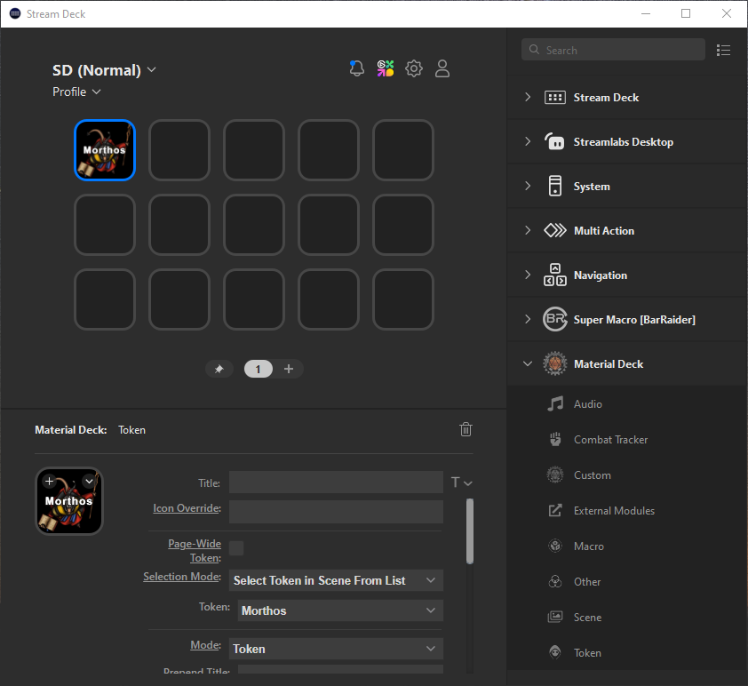
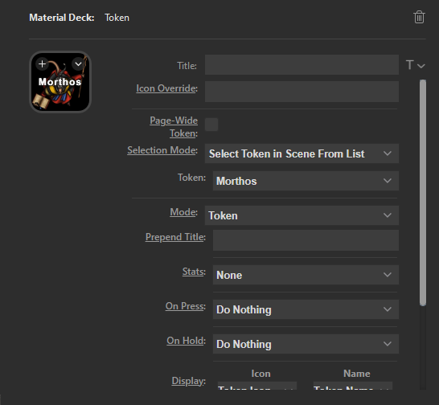

The Material Deck plugin's functionality is split into different 'actions', where each action handles different aspects of Foundry VTT. For example, there is an audio action, which can be used to start and stop playlists, play sounds from a soundboard, or set volume levels. The token action can do things related to tokens and actors, such as moving them, displaying hit points, etc. You can find the full list of actions [below](#actions).

## Buttons & Dials
Stream Decks can offer 2 different input/output types:

### Buttons
All Stream Decks currently available have multiple buttons. 
Buttons can be pressed, released and held, and depending on the action one or more of these can be used to do something in Foundry. 
Each button has its own display that can display various things, like icons and text.

### Dials
Dials can be found on the [Stream Deck +](https://www.elgato.com/us/en/p/stream-deck-plus-xl) line of products. These products have normal buttons on the top, with a row of dials at the bottom, with a LCD above it. 
Dials can be pressed, released and held, and you can rotate them. All actions and features that work on buttons can be used on a dial. 
For normal (non-dial) features the dial will behave identical to a button, where pressing the dial does the same as pressing a button, and the display above the dial displays the same as the display on a button. 
Most actions have some support for dial-specific features (such as rotating the dial to change volumes). These features are generally applied on top of the 'normal' button behavior. See the action pages for more info on what dials can be used for. 
If dial-specific features are enabled, the left part of the dial's LCD will display the 'normal' button display, while the right part will display dial-specific information.

## Applying an Action to a Button
To use a Stream Deck button with Material Deck, you must apply an action to that button.
After [installing the Material Deck plugin](../gettingStarted/installation.md#stream-deck-plugin), the Material Deck category will appear on the right side of the Stream Deck app. Expanding the category will reveal all the Material Deck actions. By dragging one of the actions onto one of the 'buttons', the action will be assigned to that button.
 
## Editing an Action

By pressing one of the 'buttons' in the Stream Deck app, you can edit the action. 
All the settings for that action will be displayed in the 'Property Inspector' at the bottom-left. 

The function of each setting is explained in the documentation of that specific action, see [below](#actions).

### Setting the Text/Title
It is important to note that by setting the button text/title in the 'Title' field, you will prevent Material Deck from automatically setting the title. It will function as an override.

#### Text/Title Font, Color, Orientation, etc
To the right of the 'Title' field, there is a dropdown menu that allows you to configure the title settings. 
These settings will have effect on titles entered into the 'Title' field, but also on any text that has been sent by Material Deck.

### Setting the Icon
It is possible to set the button's icon within the Property Inspector (by pressing the `+` or `v` buttons). 
If you do this, Material Deck will not be able to change the icon. It will function as an override.

#### Supported Image Formats
The following image formats are supported:

| Format            | Transparency  | Notes                     |
|-------------------|---------------|---------------------------|
| png               | Yes           |                           |
| jpeg/jpg          | No            |                           |
| webp              | Yes           |                           |
| gif               | Yes           | Displayed as still image  |
| webm              | Yes           | Displayed as still image  |
| mp4               | No            | Displayed as still image  |
| m4v               | No            | Displayed as still image  |
| [Font Awesome](https://fontawesome.com) icons | Yes   | Use, for example, `fas fa-user` or `fa-solid fa-user` as the icon source |

#### Icon Transparency
Image formats that support transparency allow you to set the background image (on supported actions).

#### Icon Size
Icons displayed on the Stream Deck are 144x144 pixels. 
Images bigger or smaller than this will be up or downscaled.

## How To Use The Actions Documentation
Each of the actions are listed in the column on the left, or can be accessed [below](#actions).

For each action and modes/functions of that action you will be presented with multiple options, like this:

| Option | Description |
|--------|-------------|
| Option 1 | Description of option 1. |
| Option 2 | Description of option 2. |

These options will (usually) correspond with a setting in the [Property Inspector](#editing-an-action). 
The `Description` column will give a short description of what the option/setting does, it might give an overview of selection options for a drop-down menu, or it might link to a more thorough explanation.

## Actions
The following actions are available:

* [Audio](./audio/audio.md): Control playlists, play audio from the [soundboard](../actions/audio/soundboard.md), or play audio from any source.
* [Combat Tracker](./combatTracker.md): Control the combat tracker or display combatants.
* [Custom Actions](./custom/custom.md): Configure fully customized actions.
* [External Modules](./externalModules.md): Use Material Deck with other modules.
* [Macro](./macro.md): Trigger macros or execute custom code.
* [Other Actions](./otherActions.md): Misc other actions.
* [Scene](./scene.md): Display and control scenes.
* [Token](./token/token.md): Display token stats, control tokens, and perform other token-related actions.