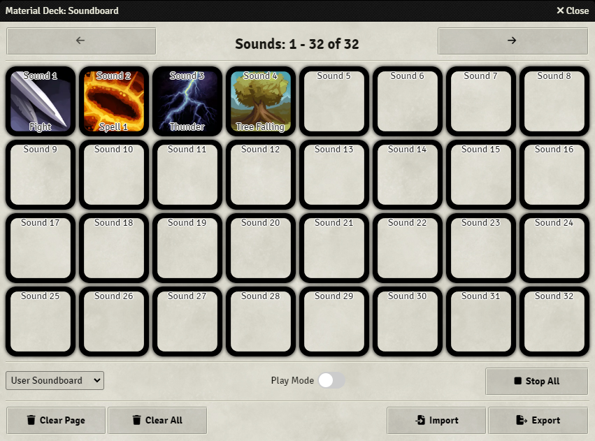
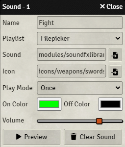
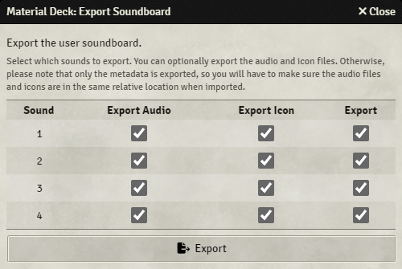
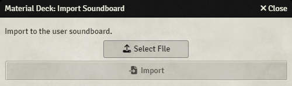
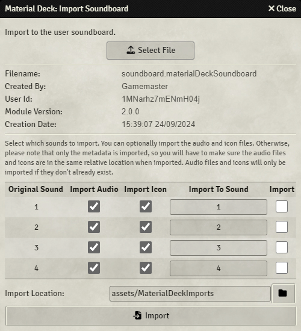

# Soundboard
Material Deck provides a soundboard from which sounds can be played from the Stream Deck or the soundboard app. 
It is part of the [Audio action](./audio.md).

A soundboard is a collection of audio files that can be played from the Stream Deck or from the soundboard app. 
The audio file can be a file on the Foundry server, such as from a playlist or stored as an asset, or the file can be hosted remotely (on the internet or your local network). 
Files can be played once, repeated, or as long as the Stream Deck button is held down.

Each user has access to 2 soundboards:

* <b>User Soundboard</b>: Each user has their own soundboard that is only accessible by that user.
* <b>World Soundboard</b>: This is a shared soundboard that all users (with [permission](../../moduleSettings/permissionConfig.md)) have access to.

## Soundboard App

The soundboard app is used to configure the soundboard. Additionally, it is possible to play sounds from the soundboard app. 
The app can be accessed from the [module settings](../../moduleSettings/moduleSettings.md), or by using the 'Open Soundboard' function on the Stream Deck, see [here](#stream-deck-configuration).

The soundboard app consists of 4 sections, from the top to the bottom:

* <b>Navigation</b>: For navigating the soundboard (display the next or previous sounds).
* <b>Sounds Section</b>: For editing or playing sounds, see [here](#sounds-section).
* <b>Controls Section</b>: For setting the soundboard to use, the play mode, and to stop all sounds, see [here](#controls-section).
* <b>Data Section</b>: For data management, such as clearing the soundboard, importing or exporting data, see [here](#data-section).

### Sounds Section
The sounds section gives an overview of the configured sounds, where each square represents a sound. 32 sounds are visible at a time, you can see the next or previous sounds by pressing the arrow keys in the navigation section at the top of the app.

Pressing one of the sound boxes will do one of two things, depending on whether `Play Mode` is enabled in the [controls section](#controls-section):

* <b>Play Mode Off</b>: Open the sound config.
* <b>Play Mode On</b>: Play/Stop the sound.

You can drag a configured sound onto another sound box to move it.

#### Sound Config

The sound config is used to configure each sound. 
Any changes are saved immediately.

| Option        | Description   |
|---------------|---------------|
| Name          | Sets the name of the sound. This will be displayed in the app or on the Stream Deck. |
| Playlist      | Sets the playlist from which to pick the sound, or, if `Filepicker` is selected, allows any file on the Foundry server to be played. |
| Sound         | The selected sound. This is either a sound from the selected playlist, or an input field for the url to the sound if `Filepicker` was selected. In case of `Filepicker`, the button on the right will open a filepicker from which the sound can be selected, or the url can be inputted manually. |
| Icon          | Sets the icon to be displayed in the app or on the Stream Deck. |
| Play Mode     | Sets the play mode: <b>-Once</b>: Will play the sound once and will stop the sound if pressed again <b>-Once - Allow Simultaneous</b>: Will play the sound once and will play the sound again if pressed again, even if it was already playing <b>-Repeat</b>: Will restart the sound if it's done playing, will stop the sound if pressed again <b>-Hold</b>: Will start the sound when pressed and stop the sound when released. |
| On Color      | A colored ring of this color will be displayed when the sound is playing. |
| Off Color     | A colored ring of this color will be displayed when the sound is not playing. |
| Volume        | Sets the volume of the sound. |
| Preview       | Will play or stop the sound so it can be previewed. |
| Clear Sound   | Will clear the sound data. |

<b>Wildcard Files</b> 
When you choose the 'FilePicker' option, you can use wildcards in the sound path to play a random sound from a selection. 
You use the `*` character as a wildcard character, meaning that `*` can be anything.

For example, say you have 4 sounds in the folder `assets`: `audio1.mp3`, `audio2.mp3`, `audio3.wav` and `anotherFile.mp3`. 
If you want to play any random file from that folder, use `assets/*`. 
If you want to only play `.mp3` files, use `assets/*.mp3`. 
If you want to only play one of the files starting with `audio`, use `assets/audio*.

<b>Playback Volume</b> 
The playback volume of the sounds is determined by 2 things:

* The volume configured in the sound config. This setting is the same for all users.
* The `Environment` volume slider in the `User Volume Controls` of the playlists sidebar tab. This setting can be configured by each user.

### Controls Section
The Controls Section has 3 settings/inputs:

| Setting/Input         | Description   |
|-----------------------|---------------|
| Soundboard Selection  | Selects whether the 'User' or 'World' soundboard is displayed. |
| Play Mode             | Sets whether the soundboard app should be in play mode: <b>-Off</b>: Pressing a sound box will open the [sound config](#sound-config) <b>-On</b>: Pressing a sound box will start or stop the sound. |
| Stop All              | Will stop all currently playing sounds. |

### Data Section
The Data Section gives some data management buttons:

| Button        | Description |
|---------------|-------------|
| Clear Page    | Clears the currently selected page. |
| Clear All     | Clears the entire soundboard (only the selected soundboard, so it will not clear the 'World' soundboard if the 'User' soundboard is selected). |
| Import        | Import soundboard data, see [here](#importing-and-exporting). |
| Export        | Export soundboard data, see [here](#importing-and-exporting). |

Please note that anything you do in the Data Section is irreversible.

### Importing and Exporting
The current soundboard can be exported, and previously exported soundboards can be imported.

During both the importing and exporting, you can choose to include the actual audio and/or icon files. 
Doing this will make sure that all files will be available on import, otherwise, you will have to make sure that when the data is imported, the audio and icon files are in the exact same relative location. 
 
For example: 
If you're exporting a sound `assets/sound1.wav`, and choose to not export the audio file, you will have to make sure that the sound `assets/sound1.wav` exists on the Foundry server when you import it.

#### Exporting

Pressing the `Export` button will open a new window. This window will have a list of all configured sounds of the currently selected soundboard.

| Option       | Description |
|---------------|-------------|
| Sound         | The number of the sound in the soundboard. |
| Export Audio  | Will export the audio file if selected. |
| Export Icon   | Will export the icon file if selected. |
| Export        | Will include this sound in the export. |

Pressing the `Export` button will start the export process. A progress bar will show the progress, after which a window will open where you can choose the file name and the location to save the file.

#### Importing

Pressing the `Import` button will open a new window. You will have to select a file to import to continue. 
Once a valid file (`.materialDeckSoundboard`) is loaded, some information about the file is displayed:

| Info              | Description |
|-------------------|-------------|
| Filename          | The name of the file. |
| Created By        | Username of the user who created the file. |
| User Id           | User id of the user who created the file. |
| Module Version    | Version of the Material Deck module that was used to create the file. |
| Creation Date     | Date and time the file was created. |

Below that, there is a list of the sounds that can be imported:

| Option            | Description |
|-------------------|-------------|
| Original Sound    | The number of the sound as it was in the exported soundboard. |
| Import Audio      | Will import the audio file if selected. This is only possible if the file is included in the file. |
| Import Icon       | Will import the icon file if selected. This is only possible if the file is included in the file. |
| Import To Sound   | The sound number of the selected soundboard to import to. This will overwrite the existing sound. |
| Import            | Will include this sound in the import. |

At the bottom, an import location can be specified. Files that are imported will be imported to this folder. 
If a sound or icon file already exists, the file will not be imported, so it will not end up in the `Import Location`.

By pressing the `Import` button, the selected sounds will be imported.

## Stream Deck Configuration
This configuration is for the `Soundboard` mode. 
See [here](./audio.md) for other modes.

| Option            | Description   |
|-------------------|---------------|
| Title             | If configured, will set the title/text on the button. This will override any other text that would normally be displayed. |
| Icon Override     | Url to a custom icon. If configured, this will override any icon that would normally be displayed. |
| Function          | Sets the function of the button: <b>-[Open Soundboard](#open-soundboard)</b>: Open or close the [soundboard app](#soundboard-app). <b>-[Play Soundboard Sound](#play-soundboard-sound)</b>: Play a sound from the soundboard. <b>-[Stop All Sounds](#stop-all-sounds)</b>: Stop all currently playing soundboard sounds. <b>-[Set Target](#set-target)</b>: Set who will hear a played sound. <b>-[Offset](#offset)</b>: Configure an offset to the selected sounds. |

### Open Soundboard
This function will allow you to open or close the [soundboard app](#soundboard-app) in Foundry.

| Option            | Description   |
|-------------------|---------------|
| Display           | <b>-Icon</b>: Display an icon on the Stream Deck. |
| Colors            | <b>-On Color</b>: A border of this color will be displayed if the soundboard app is open. <b>-Off Color</b>: A border of this color will be displayed if the soundboard app is closed. <b>-Background</b>: Background color of the button. |

### Play Soundboard Sound
This function will allow you to play a sound configured in the [soundboard app](#soundboard-app).

| Option        | Description   |
|---------------|---------------|
| Soundboard    | The soundboard from which to select a sound: 'User Soundboard' or 'World Soundboard'. |
| Sound Nr      | The selected sound. For example, setting it to `1` will start or stop `Sound 1`. |
| Display       | <b>-Name</b>: Display the name of the sound on the Stream Deck. <b>-Icon</b>: Display the icon of the sound on the Stream Deck. |
| Colors        | <b>-Background</b>: Background color of the button. |

### Stop All Sounds
Pressing the button will stop all currently playing soundboard sounds.

| Option        | Description   |
|---------------|---------------|
| Display           | <b>-Icon</b>: Display an icon on the Stream Deck. |
| Colors            | <b>-On Color</b>: A border of this color will be displayed if any sound is playing. <b>-Off Color</b>: A border of this color will be displayed if no sound is playing. <b>-Background</b>: Background color of the button. |

### Set Target
This function allows you to set a target for played sounds. Only the selected user will hear the sound.

| Option                    | Description   |
|---------------------------|---------------|
| Target                    | List of all users. Sound will only be played for that user. `All Users` will allow all users to hear the sound. |
| Reset to 'All'            | If set, will reset the target to `All Users` after the next sound is played. |
| Display                   | <b>-Icon</b>: Display an icon on the Stream Deck. |
| Colors                    | <b>-On Color</b>: A border of this color will be displayed if the current target is the same as this button's target. <b>-Off Color</b>: A border of this color will be displayed if the current target is not the same as this button's target. <b>-Background</b>: Background color of the button. |

### Offset
Offsets can be used in combination with `Sound Nr` (if `Function` is set to `Play Soundboard Sound`) to give an offset to the sound nr.

For example, if the sound offset is set to 10, a button with `Sound Nr` set to 1 will then have `Sound 11` selected, a button with `Sound Nr` set to 5 will have `Sound 15` selected.

This can be used to browse through sounds. 
For example, say you have 5 buttons with `Sound Nr` set from 1 to 5, and a button with `Offset Mode` `Increment/Decrease` and `Offset` of 1`. 
If you then press the offset button, the offset will increase to 1, so now sounds 2 through 6 are selected.

| Option            | Description   |
|-------------------|---------------|
| Offset Mode       | Sets how to set the offset: <b>-Set to Value</b>: Sets the offset to the value set in `Offset`. <b>-Increase/Decrease</b>: Increases the offset by the value set in `Offset`. |
| Offset            | The value to set the offset to (in case of `Set to Value`), or the value to increment the offset with (in case of `Increase/Decrease`).  The offset can be any value, positive or negative. |
| Display Offset    | Display the current offset on the Stream Deck. |
| On Color          | (`Set to Value` only) A border is drawn on the Stream Deck of this color if the current offset is equal to the offset configured in `Offset`. |
| Off Color         | (`Set to Value` only) A border is drawn on the Stream Deck of this color if the current offset is not equal to the offset configured in `Offset`. |

