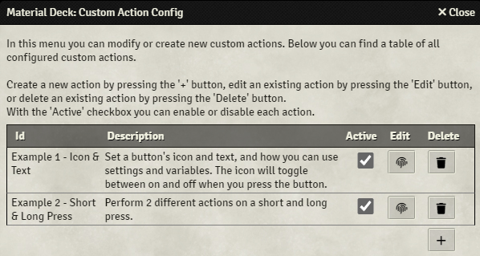
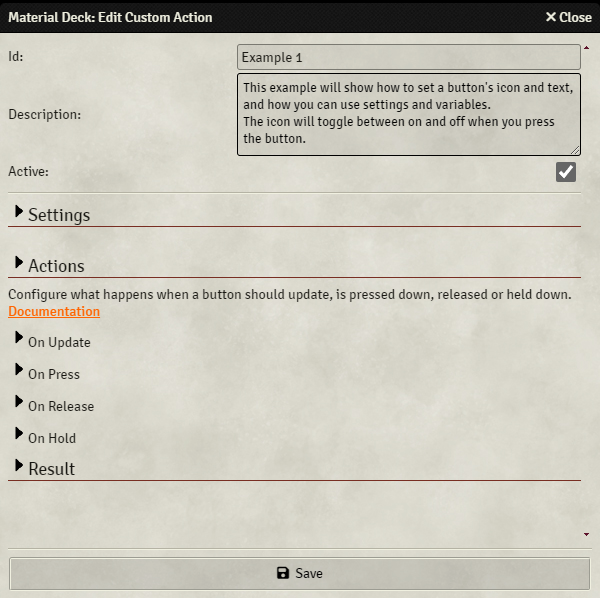
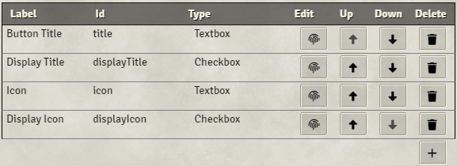
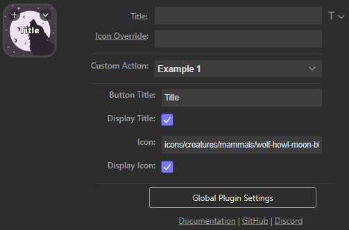
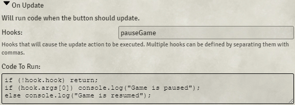
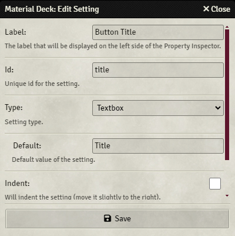

# Custom Action Config
<div class="imgContainer"></div>
The 'Custom Action Config' allows you to configure your [custom actions](custom.md). You can access this menu from the module settings.

On the main screen you can see an overview of all the configured actions with their `id`, `description` and `active` state.<br>
Toggling the `active` checkbox will enable or disable the action.<br>
You can edit the action by pressing the `edit` button or delete it using the `delete` button.<br>
New actions can be created by pressing the `+` button.

When you press the `edit` or `+` button the [Edit Custom Action](#edit-custom-action-screen) screen will open.

## Edit Custom Action Screen
<div class="imgContainer"></div>
Here you can configure the custom action.<br>
All sections with an arrow can be expanded by clicking on them.

Each custom action has the following options, of which only `id` is required:

| Option            | Description   |
|-------------------|---------------|
| Id                | A unique id for the action. |
| Description       | (Optional) A description of the action. |
| Active            | (Optional) The action will only do something if active is set to `true`. |
| Settings          | (Optional) Settings that show up in the Stream Deck app's property inspector.<br>These settings are accessible in the callback functions to customize what a button does, see [here](#settings). |
| On Update         | (Optional) Configures what to do when the button appears or a specified hook is called, see [here](#on-update). |
| On Press          | (Optional) Configures what to do when the button is pressed down, see [here](#on-press). |
| On Release        | (Optional) Configures what to do when the button is released, see [here](#on-release). |
| On Hold           | (Optional) Configures what to do when the button is held down, see [here](#on-hold). |

## Settings
<div class="imgContainer">


</div>
The settings section gives an overview of all the settings for the action.<br>

These settings will show up in the Stream Deck app's property inspector in the order that they are configured in this screen.

Each setting has the following columns:

| Column            | Description                                                           |
|-------------------|-----------------------------------------------------------------------|
| Label             | Label of the setting (will be displayed in the Property Inspector).   |
| Id                | Unique id of the setting.                                             |
| Type              | Type of the setting.                                                  |
| Edit              | Click to open the [Edit Settings](#configuring-settings) menu.        |
| Up                | Click to move the setting up.                                         |
| Down              | Click to move the setting down.                                       |
| Delete            | Click to delete the setting.                                          |

At the bottom there is a `+` button which will create a new setting and open the [Edit Settings](#configuring-settings) menu.

## On Update
<div class="imgContainer"></div>
Here you configure the 'On Update' behavior.

You enter the code at the bottom. This code will be executed when 'On Update' is called.<br>
See [here](./writingCode.md) for info on how to write code.

'On Update' is called in the following situations:

* A button with this custom action appears because:
    * A profile is opened containing the action
    * A folder is opened containing the action
    * A page is opened containing the action
    * The action is created
* The action is edited in the Stream Deck app
* Foundry refreshes and a button with the action is displayed on the Stream Deck
* A specified hook is called, see below

#### Hooks
Hooks are Foundry's event system, and they are called when things happen in the game.

Different events fire off different hooks, many of which have one or more arguments.<br>
For example, whenever the game is paused or unpaused, the `pauseGame` hook is called with a single argument that's either `true` (game is paused) or `false` (game is unpaused).

More information on hooks can be found [here](https://foundryvtt.wiki/en/development/guides/Hooks_Listening_Calling).<br>
<b>Tip</b>: If you call `CONFIG.debug.hooks = true;` in the console, all hooks that are called will be logged.

#### Code To Run
This field contains all the code that will be executed whenever 'on update' is called.<br>
This is normal JavaScript code. See [here](./writingCode.md) for info on how to write code.

In the example in the image, the code is executed whenever the `pauseGame` hook is called (so when the game is paused or unpaused). It then checks if 'on update' was called due to a hook (since it is also called in other situations):
```js
if (!hook.hook) return;
```
It then checks if the first hook argument is `true`, and if so, logs `Game is paused` to the console:
```js
if (hook.args[0]) console.log("Game is paused");
```
Otherwise it will log `Game is resumed` to the console:
```js
else console.log("Game is resumed");
```

## On Press
Here you configure the 'On Press' behavior.

The configured code under `Code to Run` will be executed whenever you press the button.<br>
This is normal JavaScript code. See [here](./writingCode.md) for info on how to write code.

## On Release
Here you configure the 'On Release' behavior.

#### Stop on Hold
Normally, when 'On Hold' is configured, the 'On Hold' code will be executed whenever its conditions apply. When you then release the button, the 'On Release' code will be executed. Ticking `Stop on Hold` will prevent the 'On Press' code from being executed if the 'On Hold' event has been called.

This allows you to create a dual-action button:

* If 'On Release' is called before 'On Hold' is triggered => Execute 'On Release' (short press)
* If 'On Hold' is triggered (before 'On Release' is called) => Execute 'On Hold' (long press)

#### Code to Run
The configured code under `Code to Run` will be executed whenever you release the button, unless `Stop on Hold` is enabled, see below.<br>
This is normal JavaScript code. See [here](./writingCode.md) for info on how to write code.

## On Hold
Here you configure the 'On Hold' behavior.

#### Delay
If `Delay` is set to `0`, or is unconfigured (empty), 'On Hold' will be triggered as soon as the button is pressed.<br>
By setting `Delay`, you can delay this from happening immediately. For example, if it's set to `1000`, 'On Hold' will be executed after holding the button for 1 second.

#### Period
By setting a value in `Period`, 'On Hold' will be triggered periodically.<br>
For example, setting it to `1000`, 'On Hold' will be triggered every second.<br>
This can be delayed by setting `Delay`, otherwise 'On Hold' will be triggered immediately when the button is pressed, and then every second after that.

#### Code to Run
The configured code under `Code to Run` will be executed whenever 'On Hold' is triggered.<br>
This is normal JavaScript code. See [here](./writingCode.md) for info on how to write code.

## Result
This is the resulting JSON object that defines the action. Any changes made will be reflected here.<br>
It is possible to directly edit this instead of using the GUI above, however, this is not recommended.

It is possible to copy `Result` from one action to another, which will essentially copy it.

## Configuring Settings
<div class="imgContainer"></div>
In this menu you can configure settings for the action. These settings will show up in the Stream Deck app's Property Inspector and are accessible from the `settings` object when [writing code](./writingCode.md).

Each setting has the following options:

| Option    | Description                                                                                           |
|-----------|-------------------------------------------------------------------------------------------------------|
| Label     | (Optional) Label of the setting. This will be displayed on the left side of the Property Inspector.   |
| Id        | Unique id of the setting, see [below](#setting-id).                                                   |
| Type      | Type of the setting, see [below](#setting-types).                                                     |
| Default   | (Optional) Default value of the setting.                                                              |
| Indent    | (Optional) Indents the setting (moves it slightly to the right in the Property Inspector).            |
| Link      | (Optional) Creates a hyperlink of the label. Insert a website's URL.                                  |

Some setting types can have more options, as discussed [below](#setting-types).

### Setting Id
The setting id is a unique identifier for the setting. It is used to later retrieve the setting's value when [writing code](./writingCode.md).

For example, if you have a `color` setting with id `backgroundColor` and its value is set to `#00FF00`, when you call `settings.backgroundColor`, it will return `#00FF00`.

You can create setting objects using `.`. For example:<br>
You create 4 settings, with ids `color.background`, `color.border`, `icon.path` and `tokenName`.<br>
The settings object will then be:
```js
{
    color: {
        background,
        border
    },
    icon: {
        path
    },
    tokenName
}
```


### Setting Types
The following setting types are available:

* [Checkbox](#checkbox)
* [Textbox](#textbox)
* [Textarea](#textarea)
* [Number](#number)
* [Select](#select)
* [Color](#color)
* [Range](#range)
* [Note](#note)
* [Line](#line)

#### Checkbox
A checkbox setting allows the user to set a boolean value (true/false).

#### Textbox
A textbox setting allows the user to input a single line of text.

#### Textarea
A textarea setting allows the user to input multiple lines of text. The element will increase or decrease in size as the text is changed.

#### Number
A number setting allows the user to input a numeric value.

| Options       | Description                                       |
|---------------|---------------------------------------------------|
| Minimum Value | Minimum allowed value.                            |
| Maximum Value | Maximum allowed value.                            |
| Step Size     | Size of each step (default to 1 if left empty).   |

#### Range
A range setting allows the user to input a numeric value using a slider.

| Options       | Description                                       |
|---------------|---------------------------------------------------|
| Minimum Value | Minimum allowed value.                            |
| Maximum Value | Maximum allowed value.                            |
| Step Size     | Size of each step (default to 1 if left empty).   |
| displayValue  | Will add a number box next to the slider.         |

#### Select
A select setting allows the user to select from a list.<br>
In the `Options` field you can add the select options.<br>
`Label` is the label of the option (what is show) and `Value` is the value that is returned if the option is selected.

For example:<br>
If you have a select setting with id `selectMode` with the following options:

1. `Label` = `Mode A` and `Value` = `a`
2. `Label` = `Mode B`and `Value` = `b`

If the option with label `Mode A` is selected in the Property Inspector, `settings.selectMode` will return `a`. When the other option is selected, it will return `b`.

#### Color
A color setting allows the user to set a color using a color picker.

#### Note
Adds text to the Property Inspector.

| Options       | Description               |
|---------------|---------------------------|
| Note          | Text to display.          |
| Font Size     | Font size of the text.    |
| Center Text   | Center the text.          |

#### Line
Adds a horizontal line to the Property Inspector.