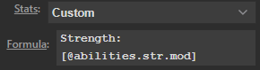

Using 'Custom Stats' you can display customized stats on the Stream Deck by providing a formule in the `Formula` field. To do this, you will need to know some basic knowledge of the underlying data structure of your gaming system.

For example, the strength modifier of a token's actor in dnd5e is: 
`actor.system.abilities.str.mod` 
To display this on the Stream Deck you need to prefix `@` before any stat and surround it by square brackets: `[` `]`. 
This results in the following formula: 
`[@actor.system.abilities.str.mod]`

There are some shorthand expressions available:

| Expression    | Equivalent                | Description                           |
|---------------|---------------------------|---------------------------------------|
| @token        |                           | Returns the token object              |
| @actor        |                           | Returns the actor object              |
| @abilities    | @actor.system.abilities   | Returns the actor's abilities object  |
| @attributes   | @actor.system.attributes  | Returns the actor's attributes object |
| @skills       | @actor.system.skills      | Returns the actor's skills object     |

Any text outside of square brackets will be displayed as normal text, and you can display multiple stats.

### Examples
To display the strength modifier: 
`[@abilities.str.mod]`

You can add text around it: 
`STR: [@abilities.str.mod]`

Display multiple stats: 
`STR: [@abilities.str.mod] DEX: [@abilities.dex.mod]`

Besides actor data you can also get token data, for example the token name: `[@token.name]`. 
Or the token's sight: `[@token.sight.range] Ft`.

You can perform a simple 'if' comparison. For example, if you want the Stream Deck to display 'Token is strong' when a token has a strength modifier of 3 or higher and 'Token is weak' for lower than 3, you could use the following formula: 
`Token is [if(@actor.system.abilities.str.mod >= 3) then(strong) else(weak)]`

Or to display the highest value of either the wisdom or intelligence: 
`[if(@abilities.wis.mod > @abilities.int.mod) then(@abilities.wis.mod) else(@abilities.int.mod)]`

You can use the following comparison operators: `==`, `<`, `>`, `<=`, `>=` 
'if then' statements and nested if statements are not supported. 