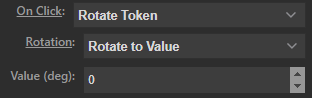
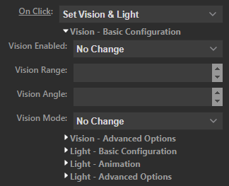
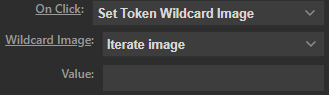

# Token Action

The Token Action allows you to control tokens and display data related to tokens, such as their hitpoints.

!!! warning "External Module Combatibility Issues"
    Many interesting token related features are system dependent. This means that to take full advantage of this action you should install a suitable system module. 
     
    This page of the documentation only handles features that are available in the core Material Deck module. For system-specific features please consult the documentation of the relevant system module. 
     
    See <a href="../../../gettingStarted/gamingSystems">here</a> for more info.
 

## General Settings

| Option            | Description   |
|-------------------|---------------|
| Title             | If configured, will set the title/text on the button. This will override any other text that would normally be displayed. |
| Icon Override     | Url to a custom icon. If configured, this will override any icon that would normally be displayed. |
| Sync Selection    | Allows you to synchronize the token/actor selection between multiple buttons. See [here](#sync-tokenactor-selection) for more info. |
| Selection Mode | Sets how to select the token: <b>-Selected Token</b>: Select the token that's currently selected in Foundry. <b>-Hovered Token</b>: Select the token by hovering over it with the mouse. <b>-User Character</b>: Select the token that's chosen as the user character in Foundry. <b>-Token Name/ID</b>: Select a token by its name or ID. <b>-Actor Name/ID</b>: Select a token by its actor's name or ID. <b>-Select Scene Token From List</b>: Select a token from a list of all tokens on the current scene. <b>-Select Actor From List</b>: Select a token from a list of all actors. |
| Name/ID | (`Token Name/ID` and `Actor Name/ID` only) Name or ID of the token/actor to select |
| Token             | (`Select Scene Token From List` only) Token to select.    |
| Actor             | (`Select Actor From List` only) Actor to select.  |
| Mode      | Sets the mode of the button: <b>-[Token](#token-mode)</b>: Functions related to the token itself, such as token movement, stats, etc. <i>Other modes may be provided through [gaming system modules](../../gettingStarted/gamingSystems.md)</i>|

### Token & Actor Selection
You select a token for the button using the above mentioned settings. 
When you specify an actor and that actor has a token on the current scene, all features will be available. 
When you specify an actor and that actor does not have a token on the current scene, not all features will be available, for example, you cannot perform the `On Click` `move` action, because there is no token to move.

## Token Mode
The token mode can be used to display stats and perform actions on the token, such as moving it, setting its vision, etc.

| Option            | Description   |
|-------------------|---------------|
| Prepend Title     | Adds text after the token/actor name (if configured), but before any text displayed through the `stats` option. |
| Stats             | Stat to display: <b>-None</b>: Don't display anything. <b>-[Custom](./customStats.md)</b>: Display a custom stat. <i>Other stats may be provided through [gaming system modules](../../gettingStarted/gamingSystems.md)</i>|
| On Press/On Hold  | Sets what to do when the button is pressed/held down: <b>-[Call Macro](#call-macro)</b>: Execute a macro. <b>-Center on Token</b>: Pans the canvas to center on the configured token. <b>-Center on Token and Select Token</b>: Pans the canvas to center on the configured token and selects the token. <b>-[Custom](./customOnClick.md)</b>: Configure a custom on click action. <b>-Delete Token</b>: Delete the selected token. <b>-Move Token</b>: Select a direction for the token to move to. The token will move `Distance` grid spaces in that direction when the button is pressed. <b>-Open Character Sheet</b>: Opens the character sheet of the configured token. <b>-Open Token Config</b>: Opens the token config of the configured token. <b>-Place Token:</b> Move or place a new token at the specified location (cursor position or coordinate). <b>-[Rotate Token](#rotate-token)</b>: Rotates the configured token. <b>-Select Token</b>: Selects the configured token. <b>-[Set Global Sync](#sync-tokenactor-selection)</b>: Sets the token/actor selection for synced buttons. <b>-[Set Page Sync](#sync-tokenactor-selection)</b>: Sets the token/actor selection for synced buttons. <b>-[Set Token Wildcard Image](#set-token-wildcard-image)</b>: Sets the image of the configured token if 'wildcard' token images are used. <b>-[Set Vision & Light](#set-vision-light)</b>: Sets the vision and light settings of the configured token. <b>-Target Token</b>: Targets the configured token. <b>-Toggle Combat State</b>: Toggles the combat state of the configured token. <b>-Toggle Visibility</b>: Toggles the visibility of the configured token between hidden to visible. <i>Other options may be provided through [gaming system modules](../../gettingStarted/gamingSystems.md)</i> |
| Display           | <b>-Name</b>: Display the token or actor name on the Stream Deck. <b>-Icon</b>: Display the token icon, actor icon, a relevant `Stat` icon or relevant `On Click` icon on the button. |
| Colors           | <b>-On Color</b>: (Only for some configurations) A border is drawn on the Stream Deck of this color if the button's function is open or active. <b>-Off Color</b>: (Only for some configurations) A border is drawn on the Stream Deck of this color if the button's function is not open or inactive. <b>-Background</b>: Background color of the button. |

### Sync Token/Actor Selection
The `Sync Selection` setting allows you to synchronize the token selection between multiple buttons on the same page (where a page is all the buttons that are currently visible on the device) or globally (all buttons on all pages, folders and profiles). This allows you to quickly change which token is assigned to multiple (or all) Token Action buttons.

#### Page Sync
All Token action buttons with `Sync Selection` set to `Page Sync` will have their token/actor selection synchronized.

For example, you might have a page on the Stream Deck that displays a lot of stats of a token and you've set `Sync Selection` to `Page Sync` for all buttons. If you then set the `Selection Mode` option to `Select Actor From List` and you select an actor, for example `Akra`, this actor will now be assigned to all buttons. 
If you then go to a different page, any `Page Sync` buttons will not be synced to the previous page.

#### Global Sync
Similar to `Page Sync`, except that the synchronization happens globally (for all buttons on any page, folder or profile).

#### Dynamically Changing Sync Settings
With the Token action `On Press` and `On Hold` settings you can choose `Set Page Sync` or `Set Global Sync`, each with the following options:

| Option    | Description  |
|-----------|--------------|
| Selection | Will assign the token/actor selection settings to all synced buttons.  |
| Token     | Will assign the token that's currently asigned to the button to all synced buttons.    |
| Actor     | Will assign the actor that's currently asigned to the button to all synced buttons.    |

Say you have a page filled with buttons with `Sync Selection` set to `Page Sync` and you've set a button with `Selection Mode`: `Hovered Token` and `On Press`: `Set Page Sync` (but `Sync Selection` set to `Disabled`): 
If the mode is set to `Selection` and you press the button, all synced buttons will now have `Selection Mode`: `Hovered Token`. 
If the mode is set to `Token` and you press the button, all synced buttons will not have `Selection Mode`: `Token Name/ID` and `Name/ID` set to the id of the token.

### Rotate Token

Allows you to rotate the token. 
You can rotate it in one of two ways:

<b>Rotate To Value</b> 
Set a value in degrees in the `Value` field and the token will rotate to that value. 
For example, 0 is the normal orientation, 90 is rotated 90 degrees. 

<b>Rotate by Value</b> 
Set a value in degrees in the 'Value' field and the token will rotate that value relative to it's current rotation. 
For example, if it is currently rotated 90 degrees, setting the value to -10 will rotate it to 80 degrees. 

### Set Vision & Light

Allows you to configure a token's vision and light settings. 
Multiple submenus are available which can be expanded or collapsed by clicking on them. 
Each submenu contains settings as you can find them in the token config. 

The settings come in multiple variants:

* <b>Selection Boxes</b>: If set to anything except `No Change`, the setting will be applied when you press the button.
* <b>Number Boxes</b>: If not empty, the setting will be applied when you press the button.
* <b>Sliders</b>: Sliders have a checkbox next to them, the setting will be applied when you press the button if the checkbox is selected.
* <b>Color Pickers</b>: Color pickers have a checkbox next to them, the setting will be applied when you press the button if the checkbox is selected.

### Set Token Wildcard Image

You can change the token image if you use the wildcard image option that foundry provides (see [here](https://foundryvtt.com/article/tokens/) for more info on how to set up wildcard images). 
When you set `On Click` to `Set Token Wildcard Image` you get the two new boxes: `Wildcard Image` and `Value`.

With `Wildcard Image` you select what you want the button to do: 

* <b>Iterate Image</b>: It will change the token image to a next one in the wildcard image list. How many images it iterates is set with the `Value` input box.
* <b>Set Image</b>: It will set the image to the n'th image of the list, where 'n' is set using the `Value` input box.
* <b>Offset</b>: You can offset the selected image by `Value`. So if on one button you have `Wildcard Image` set to `Set Image` and `Value` set to n, after pressing the button set to `Offset`, n will be n plus the offset value.

### Call Macro
You can call a macro that will be executed by the token. 
This works identical to the [Macro Action](../macro.md).

## Dial Functions
The following Dial Functions are available for dials (Stream Deck + and Stream Deck XL +):

| Dial Function     | Description                                                                                                                                   |
|-------------------|-----------------------------------------------------------------------------------------------------------------------------------------------|
| Move Token        | Moves the selected token in the specified direction.                                                                                          |
| Rotate Token      | Rotate the selected token.                                                                                                                    |
| Vision & Light    | Sets vision or light for the selected token: -Vision Range -Vision Angle -Dim Light Radius -Bright Light Radius -Light Angle.  |

The `Dial Stepsize` option sets how much the configured value should increase or decrease for each dial "tick".