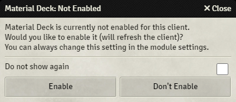
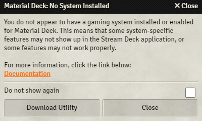

Before you try installing everything, please check the [requirements](./requirements.md).

This guide assumes that you have a [Foundry VTT](https://foundryvtt.com/) server running.

You will need to:

* [Link your Patreon account to your Foundry account](#linking-a-patreon-account)
* Install and enable the [Material Deck module](#module)
* (Optionally) install a [gaming system module](#gaming-system-modules)
* Install the [Stream Deck application](#stream-deck-application)
* Install the [Stream Deck plugin](#stream-deck-plugin)
* [Test if everything works](#testing-if-everything-works)
* (Optionally) install a [Stream Deck profile](#stream-deck-profiles)

!!! warning "Adblockers, Script Blockers and Brave Browser"
    Adblockers, script blockers and other extensions may prevent Foundry from connecting to the Stream Deck. 
    If you run into connection issues, try disabling the extension or whitelist your Foundry server. 
     
    If you're using Brave Browser, you will have to disable the shields for your Foundry server (press the lion icon, and set the shields to 'down'), or use another browser like Chrome or Firefox.
 

## Linking a Patreon Account
Material Deck is a premium module that requires a subscription to the [Material Foundry Patreon](https://www.patreon.com/materialfoundry) at the 'Material Apprentice' tier or higher. 
As a patron you can gain access to the module by linking your Patreon account to your Foundry account:

1. Log in on the [Foundry VTT website](https://foundryvtt.com/)
2. Edit your profile [here](https://foundryvtt.com/me/edit)
3. Link your Patreon account at the bottom of the page if you haven't already
4. Verify that Material Deck shows up under your [subscriptions](https://foundryvtt.com/me/subscriptions). If it doesn't appear as expected under the "Subscribed Content" page of your user profile, you may need to Refresh your Patreon link

!!! tip "Apple In-App Subscriptions"
    Apple requires a 30% app store fee for any purchases made through app store apps, which includes subscriptions like on Patreon. In reality, this means a price increase of around 43% (see [here](https://support.patreon.com/hc/en-us/articles/27991664769677-How-iOS-in-app-purchases-work-on-Patreon) for more info). Unless you want to sponsor Apple, I highly suggest not using the Patreon app to subscribe. Use a browser or non-iOS device instead.

## Module

You will need to install and enable the [Material Deck module](https://foundryvtt.com/packages/materialdeck-premium) by following [this](https://foundryvtt.com/article/modules/) guide.

When you or any players accesses a Foundry server with Material Deck enabled, while it has not been enabled for the client in the [module settings](../moduleSettings/moduleSettings.md), a popup will appear asking if you want to enable Material Deck for the client.

Any user that wants to use Material Deck should click 'Enable', other users should click 'Don't Enable'.

Tick the 'Do not show again' checkbox to prevent the popup from appearing.

## Gaming System Modules

While the core Material Deck module is system agnostic, some features will require the installation of a [gaming system module](./gamingSystems.md).

If no gaming system module is installed and enabled, a popup will appear notifying you of this every time you access the Foundry server (as a GM).

You can press the 'Download Utility' button to open the [Download Utility](../moduleSettings/downloadUtility.md) or the 'Close' button to close the popup.

Tick the 'Do not show again' checkbox to prevent the popup from appearing.

## Stream Deck Application
For you computer to communicate with your Stream Deck, you will need to install the [Stream Deck application](https://www.elgato.com/ww/en/s/downloads). 
This application is only available for Windows and MacOS. See [here](./linuxInstallation.md) for Linux users.

## Stream Deck Plugin
The Stream Deck plugin is what allows the Stream Deck to communicate with Foundry.

1. Download the latest plugin file (com.cdeenen.materialdeck.streamDeckPlugin) from [here](https://github.com/MaterialFoundry/MaterialDeck_SD/releases) or get it from the [Download Utility](../moduleSettings/downloadUtility.md)
2. Double-click the file, this should open the Stream Deck software if it's not open yet
3. Press 'Install' in the pop-up

If that doesn't work, you can try the following:

1. Download the source code from [here](https://github.com/MaterialFoundry/MaterialDeck_SD/archive/refs/tags/v1.7.2.zip)
2. Extract the file (using, for example, [WinRAR](https://www.win-rar.com/start.html?&L=0))
2. Copy the `com.cdeenen.materialdeck.sdPlugin` folder (in the 'Plugin' folder) to:
    * Windows: `%appdata%\Elgato\StreamDeck\Plugins\`
    * MacOS: `~/Library/Application Support/com.elgato.StreamDeck/Plugins/`
3. Restart the Stream Deck application.

## Testing If Everything Works
You can now test if a connection can be established between the Stream Deck and Foundry:

1. Make sure the Stream Deck is connected to your computer and you are running the Stream Deck app
2. Start a world in Foundry and access it (or refresh it)
3. A notification should appear stating `Material Deck: Connected to Stream Deck`, which means the connection is established
4. In the Stream Deck app, drag a 'Token' action to one of the buttons (see [here](../actions/actions.md) if you don't know how to do that)
5. Select a token in Foundry, its icon and name should appear on the Stream Deck

## Stream Deck Profiles
Stream Deck profiles are essentially collections of button actions that you can easily switch between.

You can create your own or download one of the pre-made profiles.

See [here](../profiles/profiles.md) for more info on profiles.
