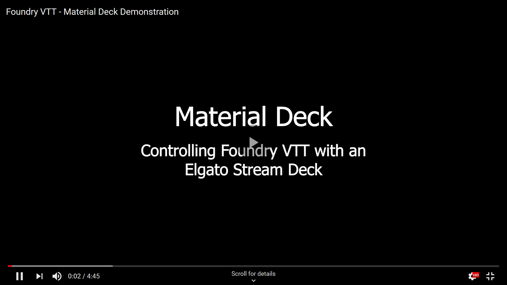

# Material Deck Documentation

    
Material Deck v2 Documentation

    

        This documentation is for Material Deck Premium (v2+). 
        For older versions, please refer to the <a href="https://github.com/MaterialFoundry/MaterialDeck/wiki">old documentation</a>.
    

 

Welcome to the [Material Deck](https://foundryvtt.com/packages/MaterialDeck) documentation.

* [Getting Started](./gettingStarted/gettingStarted.md)
* [Feedback & Issues](#feedback-issues)

## Material Deck

Material Deck is a premium [Foundry VTT](https://foundryvtt.com/) module that allows you to control certain Foundry functions using an [Elgato Stream Deck](https://www.elgato.com/ww/en/s/welcome-to-stream-deck). A Stream Deck is a device that has physical buttons with displays behind them. Material Deck uses this to, for example, control playlists, execute macros, display and control the combat tracker.

The module allows a high degree of customization, where each button on the Stream Deck can be assigned any desired function. Furthermore, it supports folder structures, allowing easy switching between various button configurations so you can easily switch between the combat tracker, soundboard, or any other (custom) configuration.

Material Deck requires a [Patreon](https://www.patreon.com/materialfoundry) subscription at the 'Material Apprentice' tier or higher, after which you can [link you Patreon account](./gettingStarted/installation.md#linking-a-patreon-account) to get access to the module through Foundry's built-in module browser.

!!! tip "Apple In-App Purchases"
    Apple requires a 30% app store fee for any purchases made through app store apps, which includes subscriptions like on Patreon. In reality, this means a price increase of around 43% (see [here](https://support.patreon.com/hc/en-us/articles/27991664769677-How-iOS-in-app-purchases-work-on-Patreon) for more info). Unless you want to sponsor Apple, I highly suggest not using the Patreon app to subscribe. Use a browser or non-iOS device instead.

## Feature Highlights

* Control tokens
* Display token stats (hitpoints, armor class, etc)
* Toggle token visibility, combat state, conditions, etc
* Open or activate scenes
* Set the scene darkness
* Start or stop playlists
* Play (soundboard) sounds
* Display and control the combat tracker
* Execute macros

And much more

## Combatibility

<b>Foundry VTT</b>: v12-v13 
<b>Module incompatibilities</b>: None known

## Feedback & Issues
If you have any suggestions or bugs to report, feel free to:

* [Create an issue](https://github.com/MaterialFoundry/MaterialDeck/issues)
* Post on the [Material Foundry Discord server](https://discord.gg/3hd4G6TkmA)
* DM me on Discord (@materialfoundry)
* Send an email: info@materialfoundry.nl