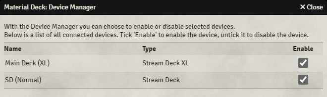

{align=right width=50%}

The device manager allows you to prevent certain devices from connecting to the Foundry client. 
You can access the device manager through the [module settings](./moduleSettings.md).

This is essential if you have multiple devices and run multiple Foundry clients on the same computer. 
For example: you have a GM client that you want to use a Stream Deck XL for, and a player client (for example for an in-person setup) that you want to use a normal Stream Deck for. If both Stream Deck's are allowed to connect to both clients, the Stream Decks will get 'confused' about which client it should communicate to. 
To solve this, you untick 'enable' for the normal Stream Deck in the device manager on the player client, and you untick it for the Stream Deck XL in the device manager on the GM client.