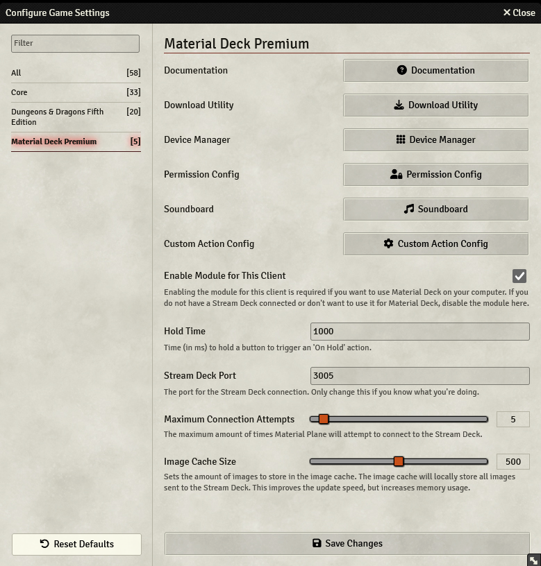

The module settings can be accessed in Foundry by pressing the 'Game Settings' (cogs icon) in the sidebar on the right, and then pressing 'Configure Settings'. This will open the 'Configure Game Settings' menu, where you have to select 'Material Deck' in the left column.

At the top you will find 5 buttons:

* <b>Documentation</b>: Pressing this button will lead you to this documentation.
* <b>Download Utility</b>: Opens the [Download Utility](./downloadUtility.md).
* <b>Device Manager</b>: Opens the [Device Manager](./deviceManager.md).
* <b>Permission Config</b>: Opens the [Permission Config](./permissionConfig.md).
* <b>Soundboard</b>: Opens the [Soundboard](../actions/audio/soundboard.md).
* <b>Custom Action Config</b>: Opens the [Custom Action Config](../actions/custom/config.md).

Below that, you will find the following settings:

* [Enable Module for this Client](#enable-module-for-this-client)
* [System Override](#system-override)
* [Hold Time](#hold-time)
* [Stream Deck Port](#stream-deck-port)
* [Maximum Connection Attempts](#maximum-connection-attempts)

## Enable Module for this Client
Each user can decide for themselves if they want to enable Material Deck (assuming the GM has allowed this in the [Permission Config](./permissionConfig.md)). 
Unticking this setting will prevent the module from trying to connect to a Stream Deck. 
Any sounds played through the [Audio Action](../actions/audio/audio.md) will still be played for users that have this setting disabled.

## System Override
Material Deck will automatically detect the current gaming system and apply the correct gaming system module (if installed and enabled). 
You can override this automatic selection here. 
See [here](../gettingStarted/gamingSystems.md) for more info on gaming system modules.

## Hold Time
Some actions will provide 'hold' functionality. This setting sets the default hold time (the time in milleseconds that you have to hold a button for it to register as a 'hold').

Please note that [system modules](../gettingStarted/gamingSystems.md) and [Custom Actions](../actions/custom/custom.md) can define their own hold time.

## Stream Deck Port
Material Deck needs to know on what port to connect to the Stream Deck. By default this is set to `3005`, but this can be changed if desired (for example, if another application uses that port). Most people will not need to change this.

If you change the port here, you will also need to change the port in the Stream Deck application. 
This can be done by selecting any Material Deck action, pressing the 'Global Plugin Settings' at the bottom, and changing the port there to the same value.

## Maximum Connection Attempts
Material Deck will attempt to connect to the Stream Deck whenever Foundry is refreshed or the connection to the Stream Deck is lost. 
It will attempt to create a connection as many times as configured here. So if set to 5, Material Deck will attempt to connect 5 times, after which it stops. You will then have to refresh Foundry to retry the connection.

Setting this to 0 will cause Material Deck to keep trying to connect indefinitely.