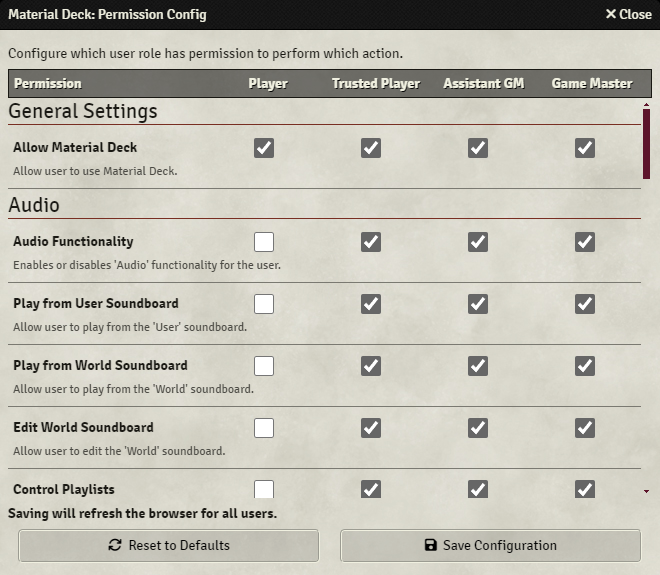
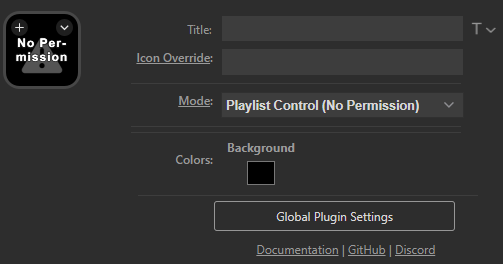

{align=right width=50%}
The permission config allows you to configure what Material Deck features are available to which users. 
It can be accessed from the [module settings](./moduleSettings.md).

All permissions are categorized by [action](../actions/actions.md) and can be enabled or disabled for each user role. 
Each setting has a description to describe what it enables or disables.

The `Save Configuration` button saves the configuration and then refreshes the Foundry client for all users.

The `Reset to Defaults` button will reset the config to the default permissions. Note that you still need to press `Save Configuration` to save any changes.

[Gaming system modules](../gettingStarted/gamingSystems.md) can modify core Material Deck permissions and add new ones.

 

## Disabled Permissions
{align=right width=50%}
{align=right}
Disabling permissions has the following effects for a button that is configured to do something that is not permitted:

* Pressing the button will notify the user that they are not allowed to perform that action (max once per 5 seconds)
* The button will display an exclamation mark icon and the text 'No Permission' 
* Some [Property Inspector](../actions/actions.md#editing-an-action) options will be hidden or marked with 'No Permission'

## Noteworty Permissions

### Allow Material Deck
The `Allow Material Deck` permission can disable almost the entire module for specified users. 
If disabled, the module will not attempt to connect to a Stream Deck. Some features, such as the [soundboard](../actions/audio/soundboard.md) are still functional.

### [Action] Functionality
Each action has a permission that can disable the action entirely for users, such as `Audio Functionality`. 
All other permission for that action will have no influence.