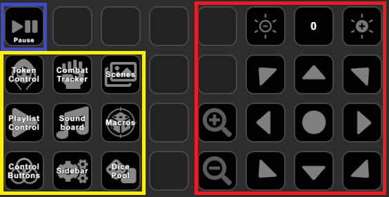
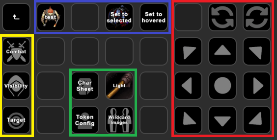
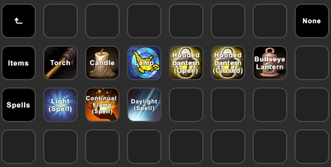
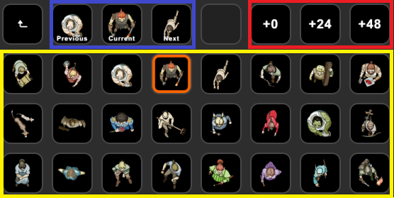
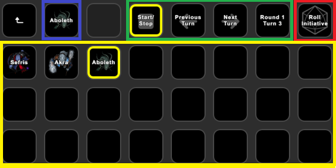
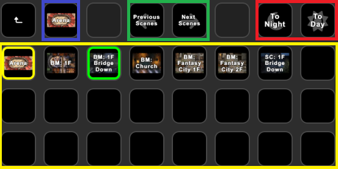

The 'MaterialDeck XL' profile is a system-agnostic profile for the Stream Deck XL. 
Feel free to use it as-is, or modify it to your liking.

## Main Screen

<blue>Pause</blue> 
Pauses or resumes the game.

<yellow>Folders</yellow> 
Folders with further functionality:

* [Token Control](#token-control)
* [Combat Tracker](#combat-tracker)
* [Scenes](#scenes)
* [Playlist Control](#playlist-control)
* [Soundboard](#soundboard)
* [Macros](#macros)
* [Control Buttons](#control-buttons)
* [Sidebar](#sidebar)
* [Dice Pool](#dice-pool)

<red>Current Scene Control</red> 
Buttons to control the current scene:

* Left buttons: Zoom in/out
* Top buttons: Change the darkness, the center button displays the current darkness level
* Other buttons: Move the canvas

## Token Control

The 'Token Control' folder allows you to control tokens.

This folder and its sub-folders have been configured to use 'Global Sync', which means that all buttons share the same token selection. 
The token that will be acted on will be referred to as the 'active token'.

#### <blue>Active Token Selection</blue>
This section sets the active token. 

The left-most button displays the currently active token. Pressing it will select the token, long-pressing it will center on the token.

The other 2 buttons allow you to configure the selected token:

* Set to selected: If you select a token in Foundry and then press this button, the selectedc token will become the active token.
* Set to hovered: If you hover over a token and press this button, the hovered token will be come the active token.

??? Tip "Tip: Custom Token Selection"
    You can easily add your own active token selection buttons, for example to select specific player character tokens:

    1. Create a new 'Token Action'
    2. Set `Selection Mode` and its sub-options so it selects the desired token (see [here](../actions/token/token.md#general-settings) for more info)
    3. Set `On Press` to `Set Global Sync`
    4. Set `On Press->Mode` to `Token` or `Actor` (see [here](../actions/token/token.md#sync-tokenactor-selection) for more info)

<yellow>Toggles</yellow> 

* Combat: Toggles the combat state for the active token
* Visibility: Toggles the visibility for the active token
* Target: Targets or untargets the active token

<red>Controls</red> 

* Directional buttons: Move the active token in the specified direction. Can be held down for continuous movement
* Arrow buttons: Rotate the active token in the specified direction. Can be held down for continuous rotation
* Circle button: Center on the active token

<green>Other</green> 

* Char Sheet: Opens the character sheet of the active token
* Token Config: Opens the token config of the active token
* [Light](#light): Opens a new folder to set light sources for the active token
* [Wildcard Images](#wildcard-images): Change the active token's image using wildcard images

### Light

You can configure a light source for the active token in this folder. 
The top-right 'None' button will disable light emission. 
The buttons in the 'Items' row correspond to light sources in DnD5e. 
The buttons in the 'Spells' row correspond to DnD5e spells that create light sources.
 

### Wildcard Images

Wildcard images allow you to configure multiple token images and easily switch between them. See [here](../actions/token/token.md#set-token-wildcard-image) for more info.

<blue>Current and Adjacent Images</blue> 
The 'Current' button displays the current token image. 
The 'Previous' and 'Next' buttons display the images before and after it, respectively. You can press these buttons to set the active token's image.

<yellow>Image Selection</yellow> 
Displays 24 wildcard images. Press one of these buttons to set the active token's image. 
The currently selected image displays an orange border.

<red>Offset</red> 
Set an offset to the images in <yellow>Image Selection</yellow>. 
For example, pressing '+24' will display the next 24 images.

## Combat Tracker

The 'Combat Tracker' folder allows you to control the combat tracker and display combatants.

??? Tip "Tip: Changing the encounter"
    All buttons in this folder have `Page-Wide Encounter` selected. This means that they will all act on the same encounter.
    You can easily change which encounter the buttons act on:

    1. Select one of the buttons
    2. Change the `Encounter` option and it's sub-options. See [here](../actions/combatTracker.md) for more info)
    3. All buttons will now update to the newly selected encounter

<blue>Current Combatant</blue> 
Displays the current combatant. Pressing it will center on the token, long-pressing it will open its character sheet.

<green>Encounter Control</green> 
Buttons to control the encounter, such as starting/stopping it, changing the turn, and displaying the current turn and round.

<red>Roll Initiative</red> 
Rolls initiative for all combatants.

??? Tip "Tip: Rolling only for PCs or only for NPCs"
    You can change `Initiative Mode` to set who this button should roll initiative for.

<yellow>Combatants</yellow> 
Displays up to 24 combatants. 
The current combatant will have a yellow border. 
Pressing one of these buttons targets the combatant, long-pressing opens its character sheet.

## Scenes

The 'Scenes' folder allows you to control which scene is shown and active.

<blue>Active Scene</blue> 
Displays the currently active scene.

<yellow>Visible Scenes</yellow> 
Displays all currently visible (in the navigation bar) scenes. 
Pressing a scene will display it. If it's already displayed, it will become the active scene. 
Long-pressing a scene will pre-load it. 
The active scene will have a yellow border, the currently displayed scene will have a green border. If they are the same scene, the border will be a combination of yellow and green.

<green>Scene Offset</green> 
Pressing these buttons will display the previous or next 24 scenes in <yellow>Visible Scenes</yellow>.

<red>Darkness Control</red> 
Pressing these buttons will transition the current scene to night or day.

## Playlist Control

## Soundboard

## Macros

## Control Buttons

## Sidebar

## Dice Pool